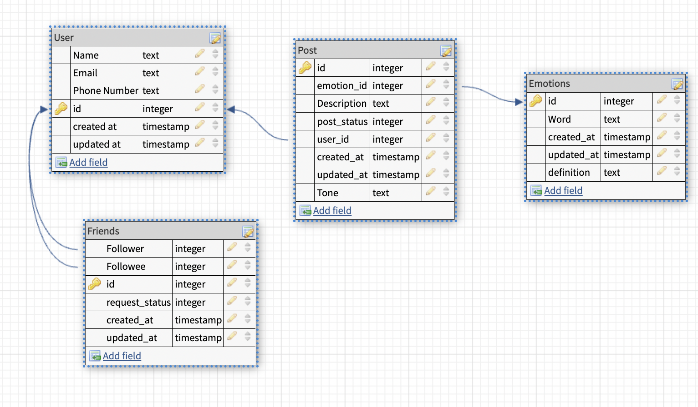
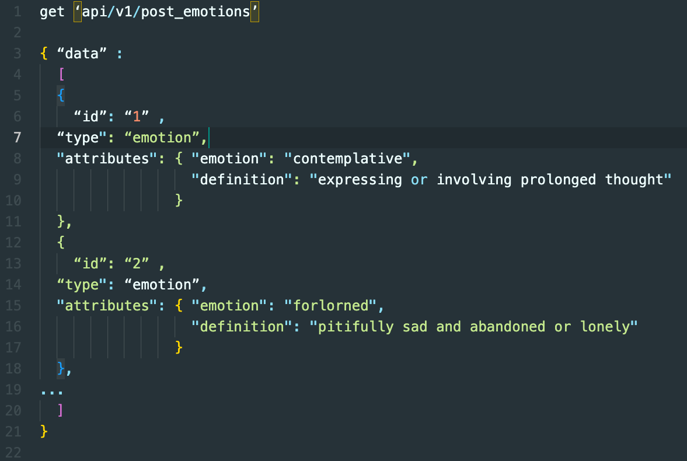

# How are you doing? ((Backend))

## Table of contents

- [Schema](#Schema)
- [Endpoints](#endpoints)
- [Contributors](#contributors)

## Schema: 

## Setup

- `Ruby 2.7.4`
- `Rails 5.2.8.1'`
- [Fork this repository](https://github.com/Alaina-Noel/How_Are_You_Doing_BE)
- Clone your fork
- From the command line, install gems and set up your DB:
- `bundle install`
- `rails db:create`
- `rails db:migrate`

## Endpoints

### Get all emotions for a post
get 'api/v1/post_emotions'

## Contributors
-   **Andrew Mullins** -  - [GitHub Profile](https://github.com/mullinsand) - [LinkedIn](https://www.linkedin.com/in/andrewmullins233)
-   **Mary Ballantyne** -  - [GitHub Profile](https://github.com/mballantyne3) - [LinkedIn](https://www.linkedin.com/in/mary-ballantyne-2712241b2)
-   **Alaina Kneiling** -  - [GitHub Profile](https://github.com/alaina-noel) - [LinkedIn](https://www.linkedin.com/in/alaina-noel/)
-   **Carter Ball** -  - [GitHub Profile](https://github.com/cballrun) - [LinkedIn](https://www.linkedin.com/in/carter-ball-01b669160/)
-   **Aleisha Mork** -  - [GitHub Profile](https://github.com/aleish-m) - [LinkedIn](https://www.linkedin.com/in/aleisha-mork/) 
