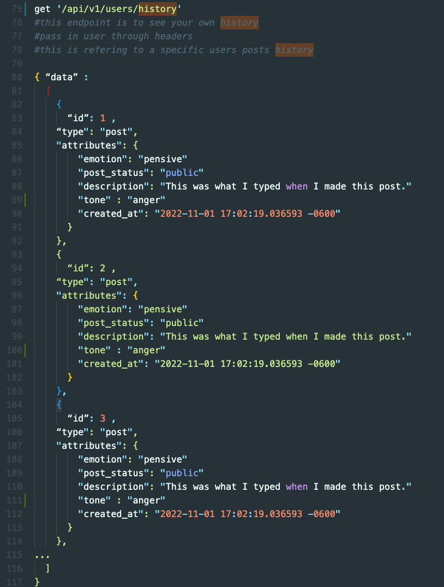
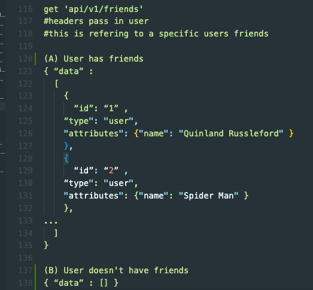
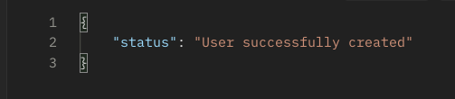
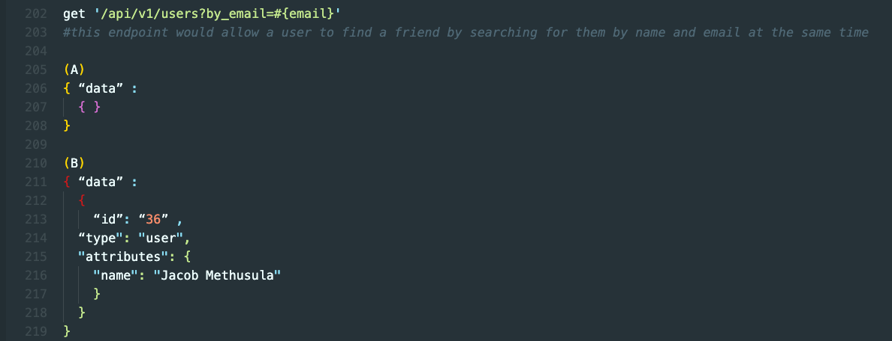

# How are you doing? ((Backend))

## Table of contents

- [Schema](#Schema)
- [Endpoints](#endpoints)
- [Contributors](#contributors)

## Schema: 

## Setup

- `Ruby 2.7.4`
- `Rails 5.2.8.1'`
- [Fork this repository](https://github.com/Alaina-Noel/How_Are_You_Doing_BE)
- Clone your fork
- From the command line, install gems and set up your DB:
- `bundle install`
- `rails db:create`
- `rails db:migrate`

# Endpoints

## Get all emotions for a post
get 'api/v1/post_emotions'

## Get all friends of a user with a status of pending
get 'api/v1/friends?request_status=pending'

## Get all friends of a user with a status of accepted
get 'api/v1/friends?request_status=accepted'

## Get the history of a current user
get 'api/v1/history'

## Get all friends of a user
get 'api/v1/friends'

## Get all posts of a particular friend of a user
get 'api/v1/friends/:friends_name/posts'

## Get a specific user based on their google id
get 'api/v1/users?search=<google_id>'

## Post a new user to the backend database
post 'api/v1/users'

## Search for a friend using their email address
get '/api/v1/users?by_email=#{email}'

## Contributors
-   **Andrew Mullins** -  - [GitHub Profile](https://github.com/mullinsand) - [LinkedIn](https://www.linkedin.com/in/andrewmullins233)
-   **Mary Ballantyne** -  - [GitHub Profile](https://github.com/mballantyne3) - [LinkedIn](https://www.linkedin.com/in/mary-ballantyne-2712241b2)
-   **Aleisha Mork** -  - [GitHub Profile](https://github.com/aleish-m) - [LinkedIn](https://www.linkedin.com/in/aleisha-mork/) 
-   **Carter Ball** -  - [GitHub Profile](https://github.com/cballrun) - [LinkedIn](https://www.linkedin.com/in/carter-ball-01b669160/)
-   **Alaina Kneiling** -  - [GitHub Profile](https://github.com/alaina-noel) - [LinkedIn](https://www.linkedin.com/in/alaina-noel/)

